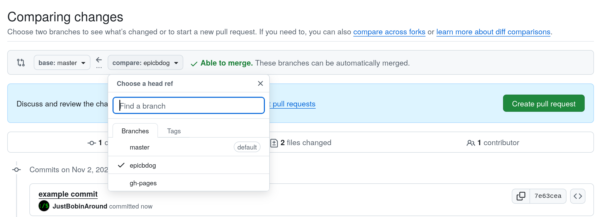

# BRANCHES AND MERGING

This doc is going to be using git from the terminal. Either git good or figure
out how to do these steps in vscode.

## Handling branches
Each contributor needs to stay within their own branch. For instance, if your
username is `epicbdog`, then you should only be contributing to the `epicbdog`
branch. To make sure you are on the correct branch always do the following:

```bash
git checkout
```

This will tell you the current branch you are on. If you are not on the correct
branch, switch to the correct branch by doing the following:

```bash
git checkout <CORRECT BRANCH NAME>
```

So for instance, if you want to switch to the `epicbdog` branch, do the following:

```bash
git checkout epicbdog
```

## Pulling from Master Branch:
**NOTE: SYNCING WITH MASTER MAY BREAK YOUR CURRENT WORK. TREAD CAREFULLY**

To sync with the master branch, do the following:
```bash
git rebase origin/master
```

This will pull the latest changes and most of the time it will handle conflicts correctly.

## Adding changes
When you have edited some files and want to save them to your branch, use the following:
```bash
git add .
git commit -m "ADD SOME MESSAGE HERE"
```

## Contributing to Master Branch:

When you are done with a full feature, run `git push` and then go to the following link in your browser: [https://github.com/JustBobinAround/gameoff_2025/compare](https://github.com/JustBobinAround/gameoff_2025/compare)

You will be presented with the following page:


Select **master** for base and the your branch for **compare**.
